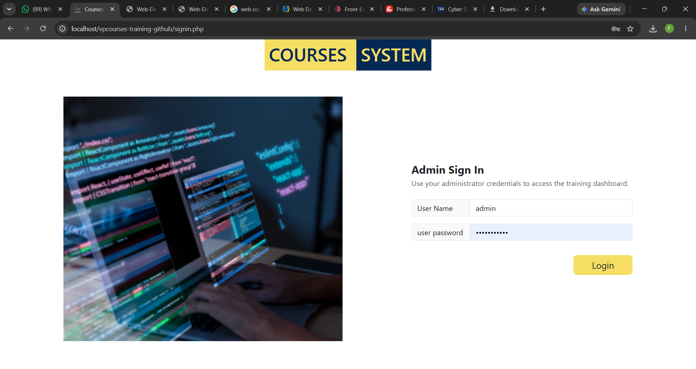
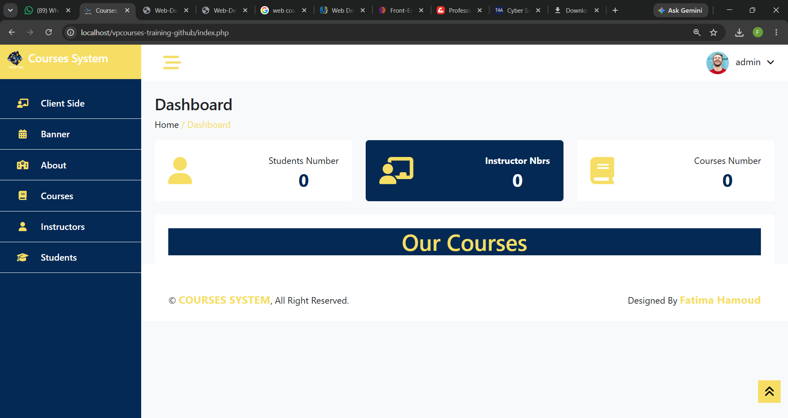
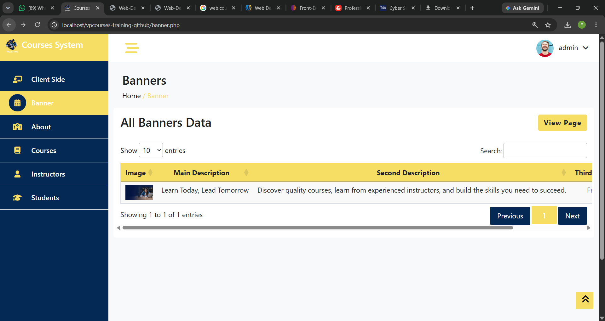
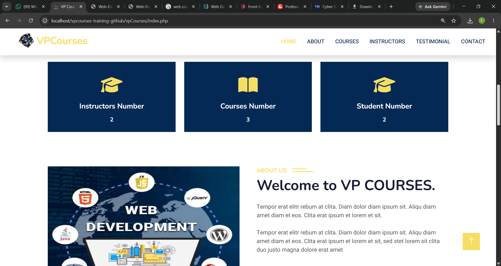
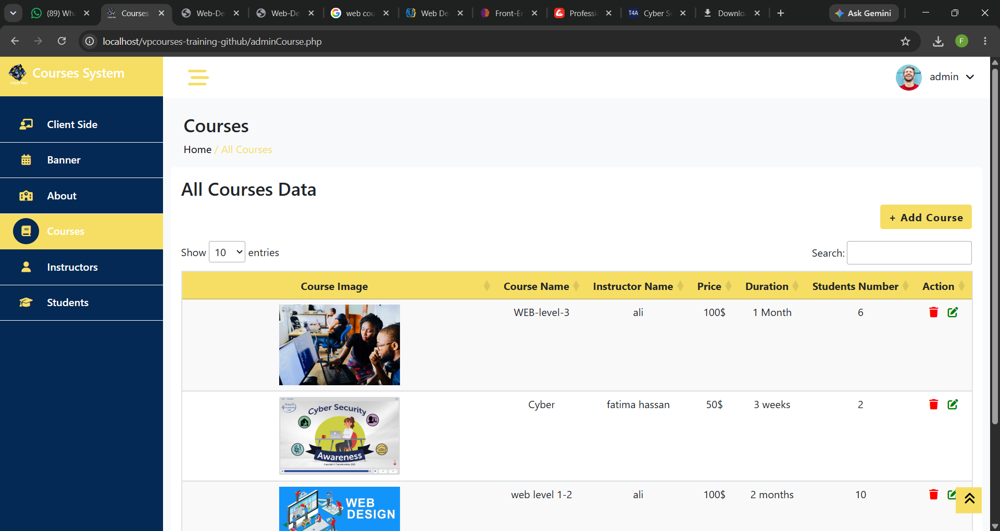
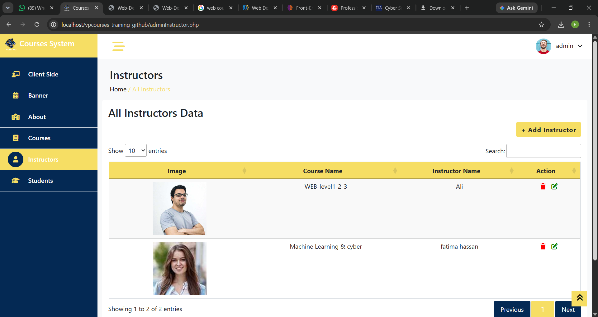
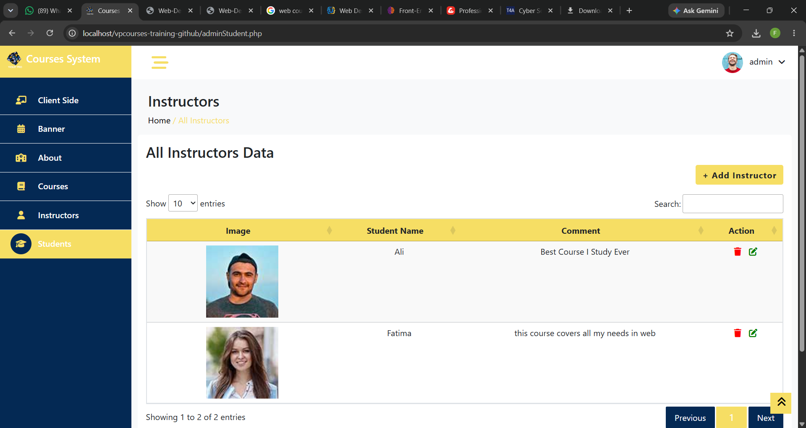
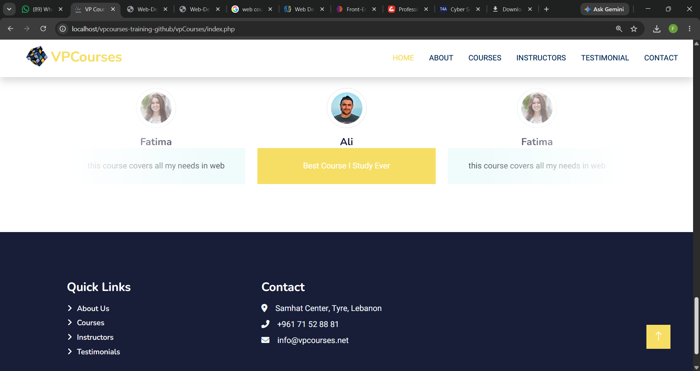
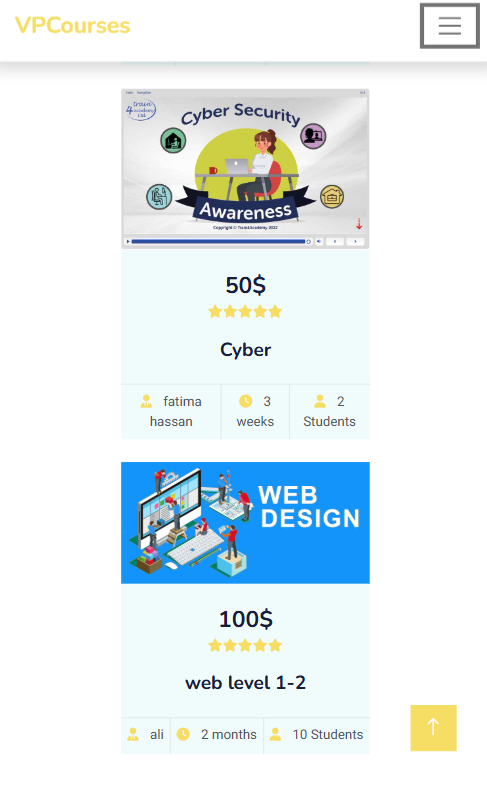

<div align="center">

# 🎓 VP Courses — Course Management System

### Level 2 — Backend & Database Development Training Project

**PHP • MySQL • HTML5 • CSS3 • Bootstrap • JavaScript**

**Violet Programming — Software Company | Beirut–Tyre, Lebanon**  
**Supervisor:** Ms. Kawthar Muslimani — Full Stack Web Developer  
**Academic Year:** 2024–2025

</div>

---

## 📑 Table of Contents

- [Overview](#overview)
- [Internship Context](#internship-context)
- [My Contribution](#my-contribution)
- [Admin Sign In](#admin-sign-in)
- [Admin Dashboard](#admin-dashboard)
- [Banner Management](#banner-management)
- [About Management](#about-management)
- [Course Management](#course-management)
- [Instructor Management](#instructor-management)
- [Student Testimonials](#student-testimonials)
- [Public Academy Website](#public-academy-website)
- [Responsive Public View](#responsive-public-view)
- [Database](#database)
- [Technology Stack](#technology-stack)
- [Project Structure](#project-structure)
- [Local Setup](#local-setup)
- [Testing](#testing)
- [Learning Outcomes](#learning-outcomes)
- [Related Internship Project](#related-internship-project)
- [Acknowledgment](#acknowledgment)
- [Project Status](#project-status)
- [Author](#author)

---

## Overview

**VP Courses** is an academy/course-management training project completed during **Level 2 — Backend & Database Development** of my web development training at **Violet Programming**.

This stage introduced me to PHP, MySQL, CRUD operations, sessions, forms, image handling, and the relationship between an administration panel, a database, and a public-facing website.

The main workflow practiced in this project was:

```text
Admin Panel
    ↓
MySQL Database
    ↓
Public Academy Website
```

My hands-on contribution focused primarily on the **Admin side** and on managing content that is stored in MySQL and displayed on the public academy interface.

This repository documents an early backend/database learning stage in my development journey.

---

## Internship Context

My training at **Violet Programming** was structured around two practical levels.

### Level 1 — Frontend Development

The first stage focused on:

- HTML
- CSS
- Bootstrap
- JavaScript
- Navigation
- Forms
- Responsive layout techniques
- Building a complete frontend website

That stage is represented by the **Nomadica Tourism Website**.

### Level 2 — Backend & Database Development

**VP Courses** represents the second stage of the same training.

The main focus was:

- PHP
- MySQL
- Database connections
- CRUD operations
- Sessions
- Forms
- Image/file handling
- Dynamic content retrieval
- Connecting Admin-managed data to a public website

Together, the two projects document the progression of the internship from frontend fundamentals to introductory full-stack development.

---

## My Contribution

My practical work in VP Courses focused mainly on the administrator workflow and its connection to the public academy website.

I worked on:

- Admin sign in and logout
- Admin dashboard
- Banner management
- About-section management
- Course management
- Instructor management
- Student testimonial management
- Add / Edit / Update / Delete operations
- Image upload, update, and deletion handling
- PHP/MySQL database interaction
- Dynamic data retrieval
- Displaying updated Admin-managed content on the client side
- Testing the main Admin/Public workflow locally with XAMPP

---

## Admin Sign In

The Admin Sign In page provides access to the protected management area using administrator credentials and session-based authentication.



---

## Admin Dashboard

The Admin Dashboard is the central entry point to the management area and provides navigation to the different content sections used during the training project.



---

## Banner Management

The Banner section allows the administrator to update the main public-site hero content.

The editable data includes:

- Banner image
- Main description
- Secondary description

Changes are stored in MySQL and reflected on the public academy website.



---

## About Management

The About section allows the administrator to update academy information that appears on the public website.

This section helped demonstrate how backend-managed content can be stored in a database and rendered dynamically on the client side.

The public About/statistics area can be seen below:



---

## Course Management

The Courses section supports the CRUD workflow practiced during the training.

The administrator can:

- Add courses
- Edit course information
- Update course images and details
- Delete courses

Course data includes:

- Course image
- Course name
- Instructor
- Price
- Duration
- Student count



---

## Instructor Management

The Instructors section allows the administrator to manage instructor information displayed on the academy website.

The administrator can:

- Add instructors
- Edit instructor information
- Update instructor images
- Delete instructors



---

## Student Testimonials

The Students section in this training project is used to manage testimonial content shown on the public academy website.

The administrator can:

- Add testimonial entries
- Edit student names and comments
- Update student images
- Delete testimonial records



---

## Public Academy Website

The repository also contains a public-facing academy interface under:

```text
vpCourses/
```

The client side displays information managed through the Admin Panel, including:

- Hero / Banner
- Academy statistics
- About content
- Popular courses
- Instructor information
- Student testimonials
- Contact information

This demonstrates the connection between:

```text
Admin Panel
    ↓
MySQL Database
    ↓
Public Website
```

### Testimonials & Contact



---

## Responsive Public View

The public academy interface was also reviewed on smaller screen sizes.

These screenshots document how the public content adapts to a narrower viewport.

### Mobile Home


### Mobile Courses



---

## Database

The MySQL database dump is included at:

```text
database/vpcourses1.sql
```

The tested Admin/Public workflow uses data related to:

- Admin authentication
- Banner content
- About content
- Courses
- Instructors
- Student testimonials
- Contact information

The original training database also contains additional academy-related structures such as:

- Students
- Instructors
- Course types
- Courses
- Course schedules
- Registrations

These structures are preserved as part of the original training database.

The repository only presents as completed features the workflows that are available and testable in the recovered project files.

---

## Technology Stack

### Backend

- PHP
- MySQL
- MySQLi
- Session-based authentication

### Frontend

- HTML5
- CSS3
- Bootstrap
- JavaScript
- DataTables
- Supporting frontend libraries

### Development Environment

- XAMPP
- Apache
- phpMyAdmin
- Visual Studio Code
- Git
- GitHub

---

## Project Structure

```text
vp-courses-training-project/
│
├── common/                         # Shared admin components / auth guard
├── css/                            # Admin-side styles
├── database/
│   └── vpcourses1.sql              # MySQL database dump
├── img/                            # Admin-side images/assets
├── js/                             # JavaScript files
├── lib/                            # Supporting frontend libraries
├── screenshots/                    # Project screenshots
├── scss/                           # Original style source files
├── vpCourses/                      # Public academy/client-side website
│
├── signin.php                      # Admin sign in
├── logout.php                      # Logout
├── index.php                       # Admin dashboard
├── banner.php                      # Banner management
├── about.php                       # About management
├── adminCourse.php                 # Course management
├── adminInstructor.php             # Instructor management
├── adminStudent.php                # Student testimonial management
│
├── addAdminCourse.php
├── updateAdminCourse.php
├── deleteAdminCourse.php
│
├── addAdminInstructor.php
├── updateAdminInstructor.php
├── deleteAdminInstructor.php
│
├── addAdminStudent.php
├── updateAdminStudent.php
├── deleteAdminStudent.php
│
├── .gitignore
└── README.md
```

---

## Local Setup

### Requirements

Install:

- XAMPP
- Apache
- MySQL
- phpMyAdmin
- A modern web browser

### 1. Clone the repository

```bash
git clone https://github.com/fatimahammoud-dev/vpcourses-training-project.git
```

### 2. Move the project into XAMPP

Example:

```text
C:\xampp\htdocs\vp-courses-training-project
```

### 3. Start Apache and MySQL

Open XAMPP and start:

```text
Apache
MySQL
```

### 4. Import the database

Open phpMyAdmin and import:

```text
database/vpcourses1.sql
```

### 5. Open the project

```text
http://localhost/vp-courses-training-project/signin.php
```

### Local Demo Credentials

```text
Username: admin
Password: admin
```

> These credentials are included only for local demonstration of this training project.

---

## Testing

The main available workflow was tested locally using XAMPP.

Confirmed working:

- ✅ Admin sign in
- ✅ Admin dashboard
- ✅ Logout
- ✅ Banner update
- ✅ About update
- ✅ Course Add / Edit / Update / Delete
- ✅ Instructor Add / Edit / Update / Delete
- ✅ Student testimonial Add / Edit / Update / Delete
- ✅ Image handling
- ✅ MySQL data updates
- ✅ Dynamic public-site content
- ✅ Public academy page
- ✅ Smaller-screen public layout behavior

---

## Learning Outcomes

VP Courses helped me move from static frontend pages toward database-driven web development.

Through this training stage, I strengthened my understanding of:

- Connecting PHP to MySQL
- Reading and writing database records
- Building CRUD workflows
- Processing forms
- Managing images and database content together
- Using sessions for protected Admin pages
- Connecting Admin actions to public website content
- Debugging PHP/MySQL integration
- Understanding the basic structure of a database-driven web application

The value of this project is the learning progression it represents as an early backend/database training experience.

---

## Related Internship Project

This project represents **Level 2 — Backend & Database Development** of my web development training at Violet Programming.

The first stage of the same training focused on frontend development through:

### 🌍 Nomadica — Tourism Website

**Level 1 — Frontend Development Training**

🔗 [View Nomadica on GitHub](https://github.com/fatimahammoud-dev/nomadica-tourism-website)

Nomadica documents the frontend stage of the internship, focusing on HTML, CSS, Bootstrap, JavaScript, navigation, forms, and responsive layout concepts.

---

## Acknowledgment

I would like to sincerely thank **Ms. Kawthar Muslimani**, Full Stack Web Developer and my training supervisor at **Violet Programming**, for her guidance, technical support, and encouragement throughout the training period.

Her mentorship helped me better understand how frontend interfaces, backend logic, and databases connect in practical web-development projects.

I also thank **Violet Programming** for providing the opportunity to strengthen my frontend and backend foundations through hands-on training.

---

## Project Status

**Status:** Completed Internship Training Project  
**Training Stage:** Level 2 — Backend & Database Development  
**Project Type:** Academy / Course Management Training Project  
**Main Focus:** PHP • MySQL • CRUD • Admin Panel • Dynamic Public Content  
**Environment:** Local development with XAMPP

---

## Author

### Fatima Hammoud

**Computer & Communication Network Engineering**  
Lebanese University — Faculty of Technology

---

<div align="center">

### Developed during Web Development Training at Violet Programming

**Level 2 — Moving from frontend fundamentals into PHP, MySQL, and database-driven web development.**

</div>
